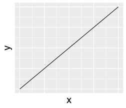

Cross references
================

## Figures

<figure>

<figcaption aria-hidden="true">Fig. 1. This is a figure
caption.</figcaption>
</figure>

**single plot**

[fig. 1](#fig-foo)

@Fig-foo

**faceted plot**

[fig. 1](#fig-foo)A

**supplementary plot**

Fig. S[1](#fig-foo)

## Equations

$$\alpha=2 \qquad(1)$$

[eq. 1](#eq-a)

@Eq-a
